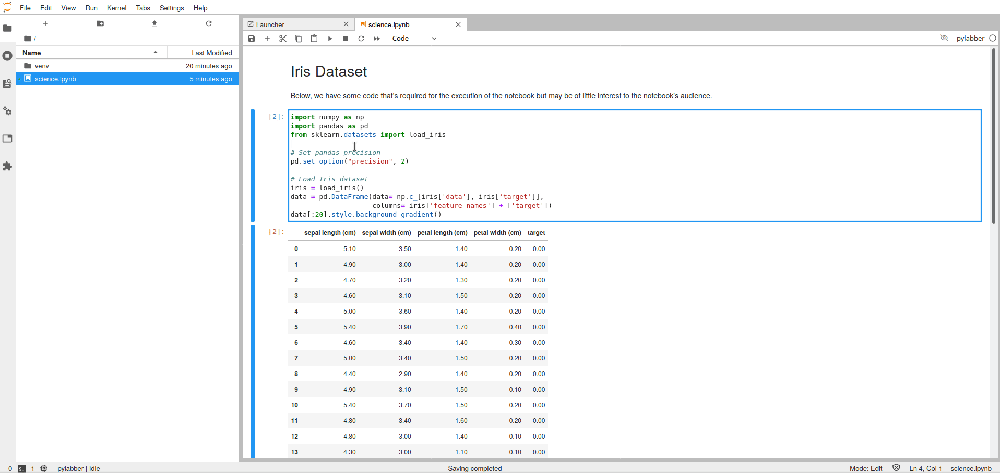

# **jupyterlab-hide-code**: A JupyterLab Extension to Run and Hide Source Code


[](https://badge.fury.io/py/jupyterlab-hide-code)

A button in JupyterLab to run the code cells and then to hide the code cells.
This JupyterLab extension was inspired by the
[jlab-hide-code](https://github.com/AixViPMaP/jlab-hide-code) JupyterLab
extension from Aachen (Aix) Virtual Platform for Materials Processing.



## Requirements

* JupyterLab >= 3.0


## Install

```bash
pip install jupyterlab-hide-code
```

## Uninstall

```bash
pip uninstall jupyterlab-hide-code
```

## Contributing

### Build

The `jlpm` command is JupyterLab's pinned version of
[yarn](https://yarnpkg.com/) that is installed with JupyterLab. You may use
`yarn` or `npm` in lieu of `jlpm` below.

```bash
# Clone the repo to your local environment
# Move to jupyterlab-hide-code directory
# Install dependencies
jlpm
# Build Typescript source
jlpm build
# Link your development version of the extension with JupyterLab
jupyter labextension link .
# Rebuild Typescript source after making changes
jlpm build
# Rebuild JupyterLab after making any changes
jupyter lab build
```

You can watch the source directory and run JupyterLab in watch mode to watch for changes in the extension's source and automatically rebuild the extension and application.

```bash
# Watch the source directory in another terminal tab
jlpm watch
# Run jupyterlab in watch mode in one terminal tab
jupyter lab --watch
```

## Acknowlegements

We acknowledge support from:
* EPFL Open Science Fund


